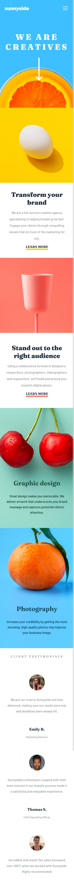

# Frontend Mentor - Sunnyside agency landing page solution

This is a solution to the [Sunnyside agency landing page challenge on Frontend Mentor](https://www.frontendmentor.io/challenges/sunnyside-agency-landing-page-7yVs3B6ef). Frontend Mentor challenges help you improve your coding skills by building realistic projects.

## Table of contents

- [Overview](#overview)
  - [The challenge](#the-challenge)
  - [Screenshot](#screenshot)
  - [Links](#links)
- [My process](#my-process)
  - [Built with](#built-with)
  - [What I learned](#what-i-learned)
  - [Continued development](#continued-development)
  - [Useful resources](#useful-resources)
- [Author](#author)

## Overview

### The challenge

Users should be able to:

- View the optimal layout for the site depending on their device's screen size
- See hover states for all interactive elements on the page

### Screenshot




### Links

- Solution URL: [Add solution URL here](https://www.frontendmentor.io/solutions/sunny-agency-landing-page-aJam_k387q)
- Live Site URL: [Add live site URL here](https://sunnyside-agency-landing-page-cyan.vercel.app/)

## My process

### Built with

- Semantic HTML5 markup
- CSS custom properties
- Flexbox
- CSS Grid
- Mobile-first workflow
### What I learned

I learn how to use grid properties for page layout , also i used for the first time the css property ::after and and :nth child ().


```css
header h1::after{
    content: url('images/icon-arrow-down.svg');
    position: absolute;
    display: block;
    top: 8rem;
    left: 48%;
 }
 .feedItem:nth-child(4) a:after { 
    content:""; 
    float:left; 
    background-color: var(--SoftRed); 
    width:100%; 
    height:6px; 
    border-radius: 3px;
}
```
### Continued development
 I continue focusing on pages layout , trying to build some mode landing pages to fix my knoledges with more practice .

### Useful resources

- [Example resource 1](https://developer.mozilla.org/en-US/docs/Web/CSS/CSS_Grid_Layout) - it probably the best document explaining css grid system .
- [Example resource 2](https://developer.mozilla.org/en-US/docs/Web/CSS/:nth-child) - This is an amazing article which helped me finally understand nth clid () property. I'd recommend it to anyone still learning this concept.

## Author
- Frontend Mentor - [@evelynmukasa](https://www.frontendmentor.io/profile/evelynmukasa)


